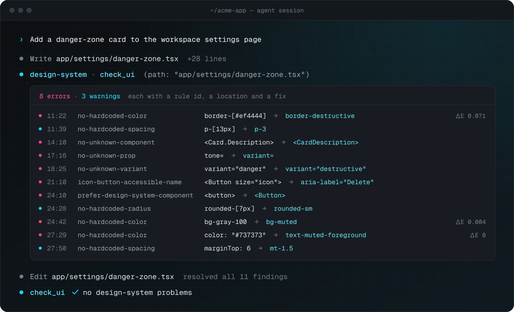
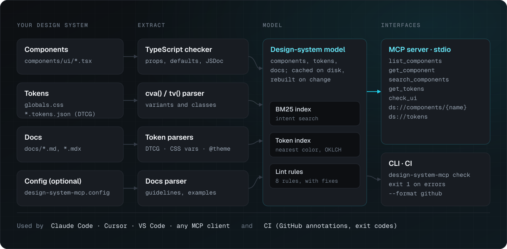

# design-system-mcp

An MCP server that gives coding agents ground truth about your React design system, and a linter they can run on their own UI.

[](https://github.com/dgesteves/design-system-mcp/actions/workflows/ci.yml)
[](https://www.npmjs.com/package/@dgesteves/design-system-mcp)
[](LICENSE)

[](https://cursor.com/en/install-mcp?name=design-system&config=eyJjb21tYW5kIjoibnB4IiwiYXJncyI6WyIteSIsIkBkZ2VzdGV2ZXMvZGVzaWduLXN5c3RlbS1tY3AiLCItLXJvb3QiLCIke3dvcmtzcGFjZUZvbGRlcn0iXX0%3D)
[](https://insiders.vscode.dev/redirect/mcp/install?name=design-system&config=%7B%22command%22%3A%22npx%22%2C%22args%22%3A%5B%22-y%22%2C%22%40dgesteves%2Fdesign-system-mcp%22%5D%7D)
[](#claude-code-plugin)

<p align="center">
  
</p>

## The problem

Coding agents write UI from their training data, not from your design system. Ask for a settings card in a shadcn/ui project and you get `bg-[#ef4444]`, `p-[13px]`, a native `<button>` with hand-rolled classes, `variant="danger"` on a `Button` that only knows `destructive`, `<Card.Header>` in a system that exports `CardHeader`, and an icon button nobody can name with a screen reader.

The agent cannot see your Storybook or docs site, and TypeScript only catches part of it after the fact. On the demo draft above, `tsc` reports 3 of the 11 problems (the invalid variant, the unknown prop and the missing member) and has no opinion on hex colors, off-scale spacing, native elements or accessible names.

`design-system-mcp` reads your components, tokens and docs, and serves them to the agent over [MCP](https://modelcontextprotocol.io): what exists, which props and variant values are valid, which token to use. It also gives the agent `check_ui`, a linter it calls on its own output. Every finding has a rule id, a location and a concrete fix, so the agent can correct itself before you review anything.

## Does it help?

Claude Code built the same ten components for [vercel/ai-chatbot](https://github.com/vercel/ai-chatbot) with and without the [plugin](#claude-code-plugin), and `check` scored what it wrote:

| Model            | Clean without | Clean with the plugin | Design-system errors | Cost |
| ---------------- | ------------: | --------------------: | -------------------: | ---: |
| Claude Haiku 4.5 |        6 / 10 |           **10 / 10** |               13 → 0 | −11% |
| Claude Opus 5    |        8 / 10 |           **10 / 10** |                5 → 0 |  +7% |

The misses were raw colors for things the prompt described ("a red alert", "a green label"), a native `<label>` where the project has `Label`, and an icon button nobody could name with a screen reader. With the plugin, the agent looked components and tokens up before writing, and every run came out clean. It is one project and forty runs, so read it as a direction. The [method, per-run results and every generated file](bench/agents) are in the repository.

## On real codebases

Run as is, with no config, on public apps. These counts are not a judgement of the teams: hardcoded values and unlabeled icon buttons slip through review everywhere, and agents copy what they see.

| Project                                                                   | Found with zero config                         | `check` findings                                                                                                                             |
| ------------------------------------------------------------------------- | ---------------------------------------------- | -------------------------------------------------------------------------------------------------------------------------------------------- |
| [vercel/ai-chatbot](https://github.com/vercel/ai-chatbot) `c2f8235`       | `components.json` → 23 components, 52 tokens   | 77 in `app/` and `components/`: 41 raw colors, 20 native elements the design system wraps, 11 icon-only buttons without an accessible name   |
| [midday](https://github.com/midday-ai/midday) `5158731`, `apps/dashboard` | workspace package `@midday/ui` → 78 components | 1,237 in `src/`, including 105 icon-only buttons without an accessible name. Adopted with a [baseline](#adopting-it-in-an-existing-codebase) |
| [shadcn/ui](https://github.com/shadcn-ui/ui) website `0132174`            | custom `ui` alias → 66 components              | 115 in `app/` and `components/`, mostly raw colors                                                                                           |

## Quickstart

No config is needed in a shadcn/ui project, a monorepo whose components live in a workspace package, or the design-system package itself ([how it finds them](#zero-config)). Give your agent the tools, check what was extracted, and run the same rules from the terminal:

```sh
claude mcp add design-system -- npx -y @dgesteves/design-system-mcp
npx @dgesteves/design-system-mcp inspect
npx @dgesteves/design-system-mcp check "app/**/*.tsx"
```

Other layouts take a [config file](#configuration). Requires Node.js 22.18 or later.

## Setup

The server speaks MCP over stdio. It finds the project from `--root`, a config file in the working directory, or the workspace roots the client reports.

### Claude Code plugin

The plugin bundles the server, a skill that tells Claude to look components and tokens up before writing UI, and a hook that runs `check` on every `.tsx`/`.jsx` file Claude writes or edits and hands the errors back, so they get fixed in the same turn instead of in review:

```sh
/plugin marketplace add dgesteves/design-system-mcp
/plugin install design-system@dgesteves
```

```text
⏺ Write(app/promo/page.tsx)
  ⎿  PostToolUse hook: app/promo/page.tsx breaks the project's design system
     1:58 error [no-hardcoded-color] Hardcoded color `bg-[#f5f5f5]` → `bg-muted`.
     1:77 error [prefer-design-system-component] Native <button> where the design system has <Button>.
     …
⏺ The hook flagged five issues. Looking up Button and the color tokens before fixing.
⏺ design-system - get_component (MCP)(name: "Button")
⏺ Write(app/promo/page.tsx)   →   <Button variant="destructive"> on bg-muted, hook passes
```

The hook only speaks up about what Claude just changed: after an Edit it lists the findings on the edited lines and only counts older ones, it honours a [baseline](#adopting-it-in-an-existing-codebase), and it stays quiet in projects without a design system, so installing the plugin for every project is safe. Like `check`, it leaves the design system's own files alone: an edit to `components/ui/button.tsx` changes the design system, which is a call for you and your reviewers rather than a lint error. Warnings go to Claude as context without blocking. It runs the project's own install when there is one, else `npx`, and finds the project from the edited file, so it works in monorepos. If you added the server with `claude mcp add` before, remove that entry (`claude mcp remove design-system`) to avoid two copies of the tools.

### Other clients

<details open>
<summary><strong>Claude Code (server only)</strong></summary>

```sh
claude mcp add design-system -- npx -y @dgesteves/design-system-mcp
```

To share it with your team, add `--scope project`, which writes `.mcp.json` at the repository root:

```json
{
  "mcpServers": {
    "design-system": {
      "command": "npx",
      "args": ["-y", "@dgesteves/design-system-mcp"]
    }
  }
}
```

</details>

<details open>
<summary><strong>Cursor</strong></summary>

`.cursor/mcp.json`:

```json
{
  "mcpServers": {
    "design-system": {
      "command": "npx",
      "args": ["-y", "@dgesteves/design-system-mcp", "--root", "${workspaceFolder}"]
    }
  }
}
```

</details>

<details open>
<summary><strong>VS Code (Copilot agent mode)</strong></summary>

`.vscode/mcp.json`:

```json
{
  "servers": {
    "design-system": {
      "type": "stdio",
      "command": "npx",
      "args": ["-y", "@dgesteves/design-system-mcp", "--root", "${workspaceFolder}"]
    }
  }
}
```

</details>

Any other MCP client: run `npx -y @dgesteves/design-system-mcp --root /path/to/app` as a stdio server. On native Windows, wrap it as `cmd /c npx ...`.

The server sends usage instructions during the MCP handshake. Clients that ignore them benefit from one line in `CLAUDE.md`, `AGENTS.md` or `.cursor/rules`: _"Before writing UI, use the design-system tools. Run check_ui on every file you change and fix all errors."_

## Tools

All tools are read-only, have zod-validated input schemas with size limits (up to 1,000,000 characters of code for `check_ui`), and return compact Markdown for the model plus JSON `structuredContent` (with an output schema) for programs.

| Tool                | Input                                           | Returns                                                                                                                  |
| ------------------- | ----------------------------------------------- | ------------------------------------------------------------------------------------------------------------------------ |
| `list_components`   | none                                            | Every component with a one-line description, the element it renders, variant values, parts and its import                |
| `get_component`     | `name`: `Button`, `CardHeader` or `Card.Header` | Import, props (types, defaults, JSDoc), cva variants and the classes each applies, parts, tokens used, docs and examples |
| `search_components` | `query`, `limit`                                | Components ranked for an intent such as "confirm a destructive action"                                                   |
| `get_tokens`        | `category?`, `query?`                           | Tokens with resolved values, dark-mode values and usages (`bg-primary`, `var(--primary)`)                                |
| `check_ui`          | `code` or `path`, `filename?`                   | Diagnostics with rule id, 1-based range, message, suggestion and edit-based fix                                          |

Resources: `ds://components/{name}` (Markdown, with name completion) and `ds://tokens` (JSON). Prompt: `build-with-design-system`, which takes a `task` and walks the agent through search, contract, tokens and `check_ui`. Claude Code exposes it as `/mcp__design-system__build-with-design-system`.

What the agent sees, from the [demo](examples/shadcn-demo):

```text
> get_component { "name": "Badge" }

# Badge
A small status label: counts, states ("Active", "Overdue") or categories.

import { Badge } from "@/components/ui/badge"
Renders <span> · components/ui/badge.tsx:29 · docs: docs/badge.md

## Props
- variant?: "default" | "secondary" | "destructive" | "success" | "outline" = "default"
- asChild?: boolean = false — Render the child element with badge styles instead of a `<span>`.
- …plus 280 props from React.ComponentProps<"span"> (onClick, id, role, children, aria-*, data-*, …)

## Variants
variant (default "default")
  default      border-transparent bg-primary text-primary-foreground
  destructive  border-transparent bg-destructive text-white
  success      border-transparent bg-success text-success-foreground
  …
```

```text
> check_ui { "code": "<Button variant=\"primary\" className=\"bg-blue-600 px-[18px]\">Save</Button>" }

snippet.tsx: 2 errors, 1 warning

1:17 error [no-unknown-variant] "primary" is not a valid variant for <Button>.
     Allowed: default, destructive, outline, secondary, ghost, link. Did you mean "default"?
1:38 error [no-hardcoded-color] `bg-blue-600` is Tailwind's default palette, not a design-system
     color. No token has this hue; nearest is ring (ΔE 0.294), a gray. Pick the semantic token
     that fits. <Button> already sets bg-* through `variant`; prefer a variant over overriding it.
1:50 warning [no-hardcoded-spacing] `px-[18px]` is 18px, which is on the spacing scale: use
     `px-4.5`.
```

## Rules

| Rule                             | Default | Catches                                                                                                                                                                                                                                        | Suggests                                                                                                                                                                                                          |
| -------------------------------- | ------- | ---------------------------------------------------------------------------------------------------------------------------------------------------------------------------------------------------------------------------------------------- | ----------------------------------------------------------------------------------------------------------------------------------------------------------------------------------------------------------------- |
| `no-hardcoded-color`             | error   | Hex/rgb/hsl/oklch literals in classes (`bg-[#ef4444]`, `[color:red]`), styles and color attributes (`<svg fill>`; on components, only hex and color functions in props without known values); Tailwind default-palette classes (`bg-gray-100`) | The nearest token of the same hue whose role fits the utility (`text-gray-500` → `text-muted-foreground`), or the variant that already applies it                                                                 |
| `no-hardcoded-spacing`           | warn    | Arbitrary padding, margin and gap (`p-[13px]`, `style={{ marginTop: 6 }}`)                                                                                                                                                                     | Nearest step on the spacing scale, keeping the sign; with Tailwind v4, any whole or half step of `--spacing` (`p-3`, `p-4.5`, `p-13`) or `p-px`                                                                   |
| `no-hardcoded-radius`            | warn    | Arbitrary radius (`rounded-[7px]`, `borderRadius: 14`)                                                                                                                                                                                         | Nearest radius token (`rounded-sm`), including Tailwind's default keys; `rounded-full` (or a pill token) for values far above the scale (`rounded-[999px]`)                                                       |
| `prefer-design-system-component` | error   | Native elements a component wraps (`<button>`, `<input>`, `<dialog>`), inferred from each component's props and markup                                                                                                                         | The root component and its import, preferring one that renders the element (`NativeSelect` over `Select`); the rename is auto-fixed when it renders that element, takes its attributes or is mapped in `elements` |
| `no-unknown-component`           | error   | Invented components, dot-notation members that do not exist (`<Card.Header>`), typos                                                                                                                                                           | The flat part (`<CardHeader>`) or closest name, auto-fixed only when that component is imported                                                                                                                   |
| `no-unknown-prop`                | error   | Props a component does not accept, own or inherited (`tone`, `isDisabled`)                                                                                                                                                                     | Closest prop, with cross-library synonyms (`tone` → `variant`); `asChild` on a Base UI component (or `render` on a Radix one) gets how that library composes                                                      |
| `no-unknown-variant`             | error   | Values outside a cva variant or literal union (`variant="danger"`)                                                                                                                                                                             | Allowed values and a synonym match (`danger` → `destructive`, `small` → `sm`)                                                                                                                                     |
| `icon-button-accessible-name`    | error   | Buttons whose only content is an icon, with no `aria-label`, `aria-labelledby`, `title` or visually hidden text; a button passed as Base UI's `render` is judged by its host's children, and hidden buttons are skipped                        | `aria-label`, guessed from the icon (`Trash2` → "Delete")                                                                                                                                                         |

Color matches under ΔE 0.02 count as the same color; under 0.1 the fix is offered; beyond that the message names the nearest token but leaves the choice to the agent. A fix is only offered for a token of the same hue, or a gray for a gray, so a pale yellow is never swapped for a light gray that happens to be close. Among the tokens that qualify, the one made for the utility wins: `foreground` and `muted-foreground` for `text-*`, `fill-*` and `stroke-*`; surfaces such as `muted` for `bg-*`; `border`, `input` and `ring` for `border-*` and `ring-*`. `sidebar-*` and `chart-*` tokens are only suggested in a sidebar or a chart (by file, enclosing component or classes), and `dark:` classes are compared with dark-mode values. Likewise, a spacing or radius step that is off by more than half the value (and more than 4px) is suggested but not auto-fixed. Rules that need tokens are skipped when the design system defines none of that category; a stylesheet that imports `tailwindcss` brings Tailwind's default spacing unit and radius scale, unless the theme resets that namespace (`--spacing-*: initial`, `--radius-*: initial`), in which case only the project's own steps are suggested. Syntax errors are reported as `syntax`.

## Configuration

### Zero config

Without a config file (or with one that leaves `components` unset), the server looks for the design system in this order, and `inspect` prints what it found on its `detected` line:

1. **`components.json`** (shadcn/ui): the `ui` alias, resolved through tsconfig `paths` (`@/registry/new-york-v4/ui`) or a workspace package's `exports` (`@workspace/ui/components` in shadcn's monorepo templates), and `tailwind.css` for tokens.
2. **The root is a design-system package**: its `package.json` `exports` point at three or more component files (`"./button": "./src/components/button.tsx"` or `"./components/*": "./src/components/*.tsx"`). Exported stylesheets that exist are read as tokens, else `src/globals.css` and the like.
3. **A dependency named like a design system** (`@acme/ui`, `@acme/ui-kit`, `@acme/design-system`, `acme-ui`) that resolves to workspace sources, through a `node_modules` link or the workspace's package globs (pnpm, npm, Yarn and Bun). It is read the same way, or through its own `components.json`, and the app's own `components/ui` is kept alongside it.

A candidate whose files cannot be found is skipped. Components found through `exports` are suggested with the specifier apps use (`import { Button } from "@acme/ui/button"`, or `@acme/ui` for a package that exports a barrel). Detected stylesheets replace the stylesheet guesses below, while `*.tokens.json` files are still read, and Markdown next to detected components counts as docs. While serving, edits to `components.json`, `package.json` or the tsconfig re-run detection, and workspace packages outside the root are watched like local folders.

### Config file

`design-system-mcp.config.json` (or `.ts`, `.mjs`, `.js`) in the project root. Every field is optional; the [JSON Schema](schema.json) gives editor completion.

```json
{
  "$schema": "https://unpkg.com/@dgesteves/design-system-mcp/schema.json",
  "components": ["src/components/**/*.tsx"],
  "exclude": ["**/*.stories.tsx", "**/*.test.tsx"],
  "tokens": ["src/styles/globals.css", { "path": "tokens/*.tokens.json", "prefix": "acme" }],
  "docs": ["docs/components/**/*.mdx"],
  "importPath": "@acme/ui",
  "elements": { "a": "Link" },
  "rules": {
    "no-hardcoded-spacing": "error",
    "no-hardcoded-color": ["error", { "allow": ["#fff"] }],
    "icon-button-accessible-name": "off"
  }
}
```

| Field                 | Default                                                                                                                                                     |
| --------------------- | ----------------------------------------------------------------------------------------------------------------------------------------------------------- |
| `components`          | [Detected](#zero-config), else `components/ui/**/*.{tsx,jsx}`, `src/components/ui/**/*.{tsx,jsx}`                                                           |
| `tokens`              | Detected, else `app/globals.css`, `src/app/globals.css`, `styles/globals.css`, `src/styles/globals.css`, `src/index.css`, `app/app.css`, `**/*.tokens.json` |
| `docs`                | `docs/components/**/*.{md,mdx}` and `.md`/`.mdx` files next to the components                                                                               |
| `importPath`          | Inferred from package `exports` (`@acme/ui/button`), then `tsconfig` `paths` (`@/components/ui/button`)                                                     |
| `includeDesignSystem` | `false`: `check` skips the component files themselves ([CI](#ci))                                                                                           |
| `tsconfig`            | `tsconfig.json` in the root                                                                                                                                 |

Paths and globs are relative to the root and use forward slashes. Windows-style backslashes (`components\ui\**\*.tsx`, `.\tsconfig.app.json`) are read as separators, except in a pattern that already uses `/`, where `\` escapes glob syntax (`app/\(marketing\)/**`). A `tsconfig` that does not exist is a config error rather than a silent fallback.

Tokens can be [W3C DTCG](https://www.designtokens.org/) JSON (`$type` inheritance, aliases, object color and dimension values, `$deprecated`, modes under `$extensions.modes`) or CSS custom properties: `:root` values, `.dark` / `[data-theme]` / `prefers-color-scheme` / `@variant dark` modes, and Tailwind v4 `@theme` mappings, with `calc()` evaluated. Tailwind v3 works too: bare HSL channels (`--border: 214.3 31.8% 91.4%`) are colors, and class names come from the `colors` in `tailwind.config.*` (the one `components.json` names, else the root's) and the presets it imports from the project, read without running it. When those colors cannot be read, shadcn/ui's names are used (`--sidebar-background` is `bg-sidebar`). Token stylesheets are read as one theme, so `.dark` can live in its own file; without a `:root` block the `light` mode is the base, and a dark mode never is. A DTCG file and the CSS generated from it are merged by custom property.

`elements` maps a native element to the component that replaces it (`{ "a": "Link" }`, or a key such as `input[type=checkbox]` for a non-text input type); a mapped component is treated as a drop-in, so the rename is auto-fixed.

Docs are Markdown or MDX, one file per component, matched by `component:` frontmatter, the first heading or the file name. Fenced `tsx`/`jsx` blocks become examples (`title="..."` in the fence names them); JSDoc `@example` tags work too.

CLI flags override the file: `--root`, `--config`, `--components`, `--tokens`, `--docs` (repeatable), `--no-cache`, `--no-watch`. Run `design-system-mcp --help` for the rest.

## CI

`check` runs the same rules as `check_ui` and exits 1 on errors (or on more than `--max-warnings` warnings). It skips the design system's own component files, the ones `components` matches: they implement the scale and the primitives the rules enforce, so a fresh shadcn/ui project's `p-[3px]` is not a finding. `--include-design-system`, or `"includeDesignSystem": true` in the config, lints them too.

```yaml
- run: npx @dgesteves/design-system-mcp check "app/**/*.tsx" "src/**/*.tsx" --format github
```

`--format github` prints workflow commands, so findings show up as annotations on the pull request. `--format json` prints the raw results.

### Adopting it in an existing codebase

An established app can start with hundreds of findings (midday's dashboard has about 1,300). Record them once and commit the file:

```sh
npx @dgesteves/design-system-mcp check "src/**/*.tsx" --update-baseline
# Baseline: 1,307 findings in 275 files → design-system-mcp.baseline.json
```

From then on, `check` reads `design-system-mcp.baseline.json` from the root whenever it exists and fails only on new findings: `No new problems in 504 files (1,307 in the baseline).` Entries are keyed by file, rule and the offending text with a count, not by line, so edits elsewhere in a file do not invalidate them, while a second `bg-[#f7f7f7]` where the baseline accepts one is reported. When findings get fixed, `check` says so and prints the command that drops them, which locks in the progress. Entries of a rule you turn off are kept rather than reported as fixed, a malformed baseline (a bad merge, say) is an error rather than something to overwrite, and paths are matched by their real spelling, so `APP/` on macOS or a linked checkout finds the same entries. `--ignore-baseline` shows everything, and `--baseline <file>` uses another path. The baseline applies to the CLI only: `check_ui` still shows an agent every finding in the file it is editing.

## How it works

<p align="center">
  
</p>

1. **Components.** One TypeScript program over the component files, with the project's `tsconfig` (so path aliases and dependency types resolve). For each exported PascalCase function, `forwardRef`, `memo` or class component, and each alias of a library component (`const Dialog = DialogPrimitive.Root`), the checker gives the props type. Props declared in the project, or by packages such as Radix, are listed with types, required flags, defaults (from destructuring, `@default` or `defaultVariants`) and JSDoc. React's DOM attributes are summarised as "…plus 290 props from `React.ComponentProps<"button">`" but kept in full for linting. When dependency types are missing, extraction falls back to what resolves and marks the props as open, so the linter does not guess.
2. **Variants.** `cva()` and `tv()` calls are read from the AST: values in declaration order, defaults, per-value classes and compound variants. They are linked to a component through `VariantProps<typeof x>` or a call in its body.
3. **Composition.** Flat parts (`CardHeader` next to `Card` in `card.tsx`), static members (`Card.Header = CardHeader`) and `Object.assign(Root, { List })` become parent/part relationships. The wrapped native element comes from `ComponentProps<"button">`, `ButtonHTMLAttributes<HTMLButtonElement>`, the `forwardRef` element type, or the rendered JSX (including `const Comp = asChild ? Slot : "button"`).
4. **Model.** Components, tokens and docs form one JSON model, cached in `node_modules/.cache/design-system-mcp` and keyed on the sizes and mtimes of the component, token and docs files, the project files the components import and the tsconfig chain, plus the lockfile, the config and the package version. The server answers the MCP handshake immediately and loads in the background; requests wait for the load. File changes trigger a rebuild that reuses the previous TypeScript program, an edited config file is read again, and clients are notified that resources changed.
5. **Lint.** `check_ui` parses the snippet on its own (no type-checking), resolves each JSX tag through its imports (named, default, namespace, relative, and barrels such as `@/components/ui` or `../components/ui`) to a design-system component, and runs the rules against the model. Fixes are text edits with offsets, so an agent or a tool can apply them mechanically.

## How it compares

These tools work at different layers, and several combine well:

|                                                                | What it knows                                                                    | Checks what the agent wrote                                                                                                                         | Needs                                                                                     |
| -------------------------------------------------------------- | -------------------------------------------------------------------------------- | --------------------------------------------------------------------------------------------------------------------------------------------------- | ----------------------------------------------------------------------------------------- |
| **design-system-mcp**                                          | Your components' props, `cva` variants, parts, tokens and docs, read from source | Invented components, props and variants; native elements the design system wraps; hardcoded colors, spacing and radius; icon buttons without a name | Nothing to run or write: zero config for shadcn-style projects and design-system packages |
| [@shadcn/lint](https://github.com/shadcn-ui/lint)              | Rules you write per component                                                    | Tailwind classes: raw colors, arbitrary values, restyling a component                                                                               | ESLint or Oxlint, Tailwind v4                                                             |
| [Storybook MCP](https://storybook.js.org/docs/ai/mcp/overview) | Stories and a component manifest                                                 | Runs component tests, including accessibility checks if set up                                                                                      | A running Storybook (10.6, preview)                                                       |
| [shadcn MCP](https://ui.shadcn.com/docs/mcp)                   | Registries: what you can install                                                 | —                                                                                                                                                   | —                                                                                         |
| [Figma MCP](https://github.com/figma/mcp-server-guide)         | The design: frames, variables, Code Connect                                      | —                                                                                                                                                   | Figma                                                                                     |

@shadcn/lint polices which classes a component may take; design-system-mcp tells the agent what exists and catches what does not, without Storybook or a design file. Running both in CI is a sensible setup.

## Design decisions

**Static analysis, not another model.** The agent is already the LLM; what it lacks is ground truth. Everything here is deterministic, takes milliseconds, runs offline, needs no API key, and can be unit-tested rule by rule. The cost: it cannot judge intent, such as whether a `Dialog` was the right call. That stays with the agent and the reviewer.

**The TypeScript checker over `react-docgen-typescript`.** react-docgen-typescript wraps the same API but hides the AST, and `cva()` parsing, composition and element inference all need it. One program serves all four. The runtime dependency is TypeScript 6, the last release with the JavaScript compiler API; TypeScript 7 (the Go port) does not expose a stable one yet.

**Syntactic linting.** Agents check fragments they have not saved, often without imports. Type-checking those would need the whole program and would fail on the fragment's missing context. `check_ui` complements `tsc`: it catches what types cannot express (tokens, native elements, accessible names) and says what to write instead.

**BM25, not embeddings.** A design system is tens to a few hundred documents whose vocabulary already lives in names, docs and variant values. Field-weighted BM25 with Porter stemming and a small synonym map ("modal" → Dialog, "delete" → destructive) ranks them well, deterministically, with no model download or API key. It does not understand paraphrases the synonym map does not cover.

**OKLCH for nearest colors.** Distance in OKLCH (ΔE in OKLab) tracks perceived difference, so the suggested token is the one that looks closest, not the one with the closest hex digits. It also matches how Tailwind v4 and shadcn/ui define colors.

**Markdown for the model, JSON for programs.** Tool results put compact Markdown in `content`, which costs fewer tokens than JSON and reads well to a model, and the full JSON in `structuredContent` for clients and scripts.

### Limits

- React only. Fix suggestions are Tailwind classes when a Tailwind theme maps the token (`@theme`, or a v3 `tailwind.config`), otherwise `var(--token)` (`hsl(var(--token))` for v3 channels). A v3 config is read statically, so colors computed in code are not seen.
- Linting is per file and syntactic. Class names built at runtime (`` `bg-${color}-500` ``) are not checked, and spread props are trusted.
- `no-unknown-prop` is skipped for components whose props type does not fully resolve (dependencies not installed).
- Composition is inferred from naming and static members; other patterns need explicit exports.
- While the server runs, it rebuilds on changes in the component, token and docs folders, the config file, the tsconfig and the tsconfigs it extends. An edit to another file the components import (a shared `lib/types.ts`) is picked up on the next start.
- No typography or shadow rules yet, and stdio is the only transport.

## Roadmap

- **Angular and Web Components extraction**: signal and decorator inputs, and the Custom Elements Manifest.
- **Storybook import**: stories as examples, `argTypes` as prop docs, CSF as a docs source.
- **Figma variables**: import variables and modes as tokens, through the REST API or a DTCG export.
- Typography and shadow rules, an ESLint plugin that wraps the same rules, and a Streamable HTTP transport for remote agents.

## Development

```sh
pnpm install
pnpm test          # Vitest: extraction, tokens, every rule, search, CLI, MCP client end to end
pnpm build         # tsdown, then schema.json
pnpm smoke         # spawns dist/cli.js over stdio against the demo and calls every tool
pnpm demo:check    # the CLI on examples/shadcn-demo (exits 1: the draft has errors)
pnpm assets        # regenerates the images in .github/assets from real check output
```

Releases use [Changesets](https://github.com/changesets/changesets): add one with `pnpm changeset`.

## License

[MIT](LICENSE) © Diogo Esteves
