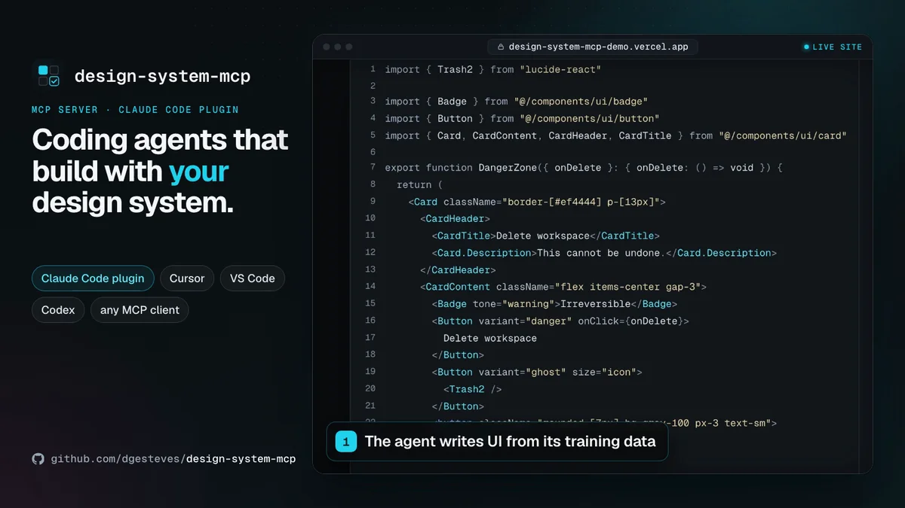

# onsystem

**Keeps coding agents on your design system:** it knows your real components, props, variants and tokens, catches the moment an agent invents one and has it fix it, and the same check gates your PRs. Local, zero config, works alongside [@shadcn/lint](https://github.com/shadcn-ui/lint).

Built for design-system and platform teams with a React design-system package; a shadcn/ui app is the zero-config demo. Formerly `@dgesteves/design-system-mcp` ([what changed](https://onsystem.vercel.app/docs/migrating)).

[](https://github.com/dgesteves/onsystem/actions/workflows/ci.yml)
[](https://www.npmjs.com/package/onsystem)
[](LICENSE)

**Website and docs:** [onsystem.vercel.app](https://onsystem.vercel.app), with a [playground](https://onsystem.vercel.app/playground) that checks your own code.

<!-- npm-readme:video -->

https://github.com/user-attachments/assets/8ca1c640-94c2-4003-b59e-2b0d819c492d

<sub>On the <a href="https://onsystem.vercel.app">website</a>, an agent drafts a settings card, <code>check_ui</code> finds 11 problems with a fix each, and the agent applies them. Then a real Claude Code session with the plugin: Claude looks the components up before writing, and <code>check_ui</code> passes. Last, the benchmark.</sub>

<!-- npm-readme:image
<p align="center">
  <a href="https://onsystem.vercel.app"></a>
</p>

<sub>On the <a href="https://onsystem.vercel.app">website</a>, an agent drafts a settings card, <code>check_ui</code> finds 11 problems with a fix each, and the agent applies them. Then a real Claude Code session with the plugin: Claude looks the components up before writing, and <code>check_ui</code> passes. Last, the benchmark.</sub>
-->

## The problem

Coding agents write UI from their training data, not from your design system. Ask for a settings card and you get `bg-[#ef4444]`, `p-[13px]`, a native `<button>`, `variant="danger"` on a `Button` that only has `destructive`, and `<Card.Header>` where the system exports `CardHeader`. On the demo draft above, `tsc` reports 3 of the 11 problems, and review catches the rest when someone has the time. Describing the design system to the agent helps; what holds is checking what it actually wrote, at the edit and at the pull request.

## What it checks

onsystem reads your components, `cva` and `tv` variants, parts and tokens from source with the TypeScript compiler, and checks `.tsx` and `.jsx` against them. Every finding has a rule id, a location and the fix.

| Rule                             | Default | Catches                                                                         |
| -------------------------------- | ------- | ------------------------------------------------------------------------------- |
| `no-unknown-component`           | error   | Components and parts that don't exist (`<Card.Header>`, typos)                  |
| `no-unknown-prop`                | error   | Props a component doesn't take (`tone`, `isDisabled`)                           |
| `no-unknown-variant`             | error   | Values outside a variant (`variant="danger"`)                                   |
| `prefer-design-system-component` | error   | Native elements the design system has a component for (`<button>` → `<Button>`) |
| `no-hardcoded-color`             | error   | Hex, rgb, hsl, oklch and Tailwind palette colors (`bg-gray-100` → `bg-muted`)   |
| `icon-button-accessible-name`    | error   | Icon-only buttons without an accessible name                                    |
| `no-hardcoded-spacing`           | warn    | Arbitrary padding, margin and gap (`p-[13px]` → `p-3`)                          |
| `no-hardcoded-radius`            | warn    | Arbitrary radius (`rounded-[7px]` → `rounded-sm`)                               |

**How often it is wrong.** The [corpus](corpus) job runs `check` on 10 public repositories pinned by commit (Documenso, Dub, Cal.com, midday and others, the four monorepos also from their root: 21 runs, 4,731 findings) and compares the findings with hand labels. In a random sample of 126 findings, 5 are false positives (4.0%) and 55 are debatable; weighted by each run's and rule's share of all findings, about 1.0% are false positives. Shipped code rarely invents components, props or variants, so those three rules have 1 finding in the corpus and none in the sample; their precision comes from the test suite. The [rules reference](https://onsystem.vercel.app/rules) shows each rule on an example and how to [suppress a finding](https://onsystem.vercel.app/rules#suppressing-findings).

## Quickstart

Run it from the app's folder or from the monorepo root, with Node.js 20.19 or later. `npx onsystem inspect` shows what it found, and `--explain` why; at a [monorepo root](https://onsystem.vercel.app/docs/configuration#monorepo-roots), every app and design-system package, each file checked by its own project's design system. `npx onsystem init` writes the config from it and offers a baseline.

**Claude Code.** The plugin brings the hook, the MCP server and a skill:

```text
/plugin marketplace add dgesteves/onsystem
/plugin install onsystem@dgesteves
```

After each Write or Edit of a `.tsx` or `.jsx` file, the hook runs `onsystem check` on it. Errors go back to Claude as a blocking error with the fix, so Claude corrects the file before it moves on; warnings go as a note. It stays quiet in projects without a design system. [What it runs and touches](https://onsystem.vercel.app/docs/plugin).

**Cursor or VS Code.** [](https://cursor.com/en/install-mcp?name=onsystem&config=eyJjb21tYW5kIjoibnB4IiwiYXJncyI6WyIteSIsIm9uc3lzdGVtIiwiLS1yb290IiwiJHt3b3Jrc3BhY2VGb2xkZXJ9Il19) [](https://insiders.vscode.dev/redirect/mcp/install?name=onsystem&config=%7B%22command%22%3A%22npx%22%2C%22args%22%3A%5B%22-y%22%2C%22onsystem%22%5D%7D), or commit the [config](https://onsystem.vercel.app/docs/clients#cursor-and-vs-code). The agent gets the tools and runs `check_ui` on what it writes.

**Other agents.** `npx skills add dgesteves/onsystem` adds the skill to any agent with Agent Skills, and there are [plugins for Codex, GitHub Copilot CLI, VS Code and Cursor](https://onsystem.vercel.app/docs/clients#plugins-for-other-agents).

**Any MCP client.** Run `npx -y onsystem` as a stdio server. There are [configs for Claude Desktop, Codex CLI, GitHub Copilot CLI, Windsurf, JetBrains IDEs, Zed, Gemini CLI and Grok Build](https://onsystem.vercel.app/docs/clients#other-clients).

**CI.** Install it as a dev dependency, accept the findings the codebase already has once, and fail pull requests only on new ones:

```sh
npm install --save-dev onsystem
npx onsystem check . --update-baseline   # writes onsystem.baseline.json: commit it
```

```yaml
- run: npx onsystem check . --format github --require-design-system
```

Findings show up as annotations on the pull request, and `--require-design-system` fails the job when the design system is no longer found. [CI and baselines](https://onsystem.vercel.app/docs/ci) has the whole workflow. The GitHub Action, `uses: dgesteves/onsystem@v0`, annotates only the lines a pull request changed: [make it a required check on agent pull requests](https://onsystem.vercel.app/docs/required-check).

**ESLint.** The same rules for ESLint 9 and 10: add `onsystem.configs.recommended` from `onsystem/eslint` to `eslint.config.mjs` ([ESLint plugin](https://onsystem.vercel.app/docs/eslint), with @shadcn/lint).

## Works with @shadcn/lint

[@shadcn/lint](https://github.com/shadcn-ui/lint) checks the Tailwind classes written against a component and the theme (restyling, raw colors, arbitrary and unknown classes) as ESLint or Oxlint rules on Tailwind v4. onsystem checks that the components, props and variant values exist, flags native elements and unnamed icon buttons on Tailwind v3 or v4, and in Claude Code catches an invented one right after the edit, so run both.

## Does it help?

Claude Code built the same ten components for [vercel/ai-chatbot](https://github.com/vercel/ai-chatbot), once as it ships and once with the plugin, and `check` scored what it wrote:

| Model            | Clean without | Clean with the plugin | Design-system errors | Cost |
| ---------------- | ------------: | --------------------: | -------------------: | ---: |
| Claude Haiku 4.5 |        6 / 10 |           **10 / 10** |               13 → 0 | −11% |
| Claude Opus 5    |        8 / 10 |           **10 / 10** |                5 → 0 |  +7% |

It is small: one repository, Claude models only, 40 runs (one per task, model and condition), scored by the tool itself, and run before the rename. With the plugin, the agent looked components and tokens up before writing, and the hook never had to block. Read it as a direction, not a rate; the [method, per-run results and every generated file](bench/agents) are in the repository.

## Docs

On the [website](https://onsystem.vercel.app/docs), and as Markdown in [docs/](docs):

- [Quickstart](https://onsystem.vercel.app/docs), [Claude Code plugin](https://onsystem.vercel.app/docs/plugin), [CI and baselines](https://onsystem.vercel.app/docs/ci) and [Set up your agent](https://onsystem.vercel.app/docs/clients), with the config for each client
- [Configuration](https://onsystem.vercel.app/docs/configuration), [Rules](https://onsystem.vercel.app/rules), [MCP tools](https://onsystem.vercel.app/docs/tools) and [Troubleshooting](https://onsystem.vercel.app/docs/troubleshooting)
- [How it works](https://onsystem.vercel.app/docs/how-it-works), [FAQ](https://onsystem.vercel.app/docs/faq) and [Migrating from design-system-mcp](https://onsystem.vercel.app/docs/migrating)

[Contributing](CONTRIBUTING.md), [security](SECURITY.md) and the [changelog](CHANGELOG.md) are in the repository.

## License

[MIT](LICENSE) © Diogo Esteves
